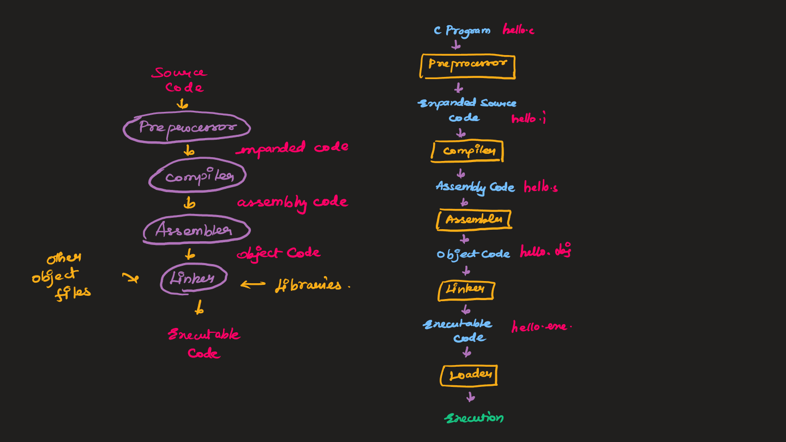

# **Basic C Programming**

## **Index**

- [Introduction to C Programming](#introduction-to-c-programming)

  - [History of C Programming Language](#history-of-c-programming-language)
  - [Difference between interpreter and compiler](#difference-between-interpreter-and-compiler)
  - [Compilating C Program behind the scenes](#compiling-c-program-behind-the-scenes)
  - [Introduction to Programming in C](#introduction-to-programming-in-c)

- [C - Tokens](#c---tokens)
- [Datatypes](#datatypes)

  - [Bool Datatype](#bool-datatype)
  - [Different types modifiers and their range](#different-types-of-modifiers-and-their-range)
  - [Format Specifiers](#format-specifiers)
  - [Type Conversions](#type-conversion)
  - [Constants](#constants)

- [Operators in C](#operators-in-c)
  - [Types of Operators](#types-of-operators)
  - [Operator precedence and Associativity](#operator-precedence-and-associativity)

## **Introduction to C Programming**

### **History of C Programming Language**

- **Developed by:** Dennis Ritchie at AT&T Bell Labs in 1972.
- **Origin:** Derived from the **B programming language**, which was developed by Ken Thompson.
- **Purpose:** Initially created to develop the **UNIX operating system**.
- **Evolution:**
  - **C language** became widely adopted because of its **portability** and efficient features.
  - **Standardization:**
    - In 1983, the **ANSI (American National Standards Institute)** formed a committee to standardize C, resulting in **ANSI C**.
    - The **ISO (International Organization for Standardization)** later standardized it globally.
- **Key Features:**
  - **Low-level access** to memory.
  - **Portability** across different systems.
  - **Structured programming** language.
  - **Supports recursion** and provides **rich set of operators**.

---

### **Difference Between Interpreter and Compiler**

| Aspect                | **Interpreter**                                     | **Compiler**                                         |
| --------------------- | --------------------------------------------------- | ---------------------------------------------------- |
| **Definition**        | Translates code line-by-line at runtime.            | Translates the entire code at once before execution. |
| **Translation Speed** | Slower (line-by-line translation).                  | Faster (one-time translation).                       |
| **Execution Speed**   | Slower (executes code directly during translation). | Faster (executes compiled code directly).            |
| **Error Detection**   | Stops at the first error and reports it.            | Reports all errors after entire code compilation.    |
| **Output**            | No intermediate output, executes directly.          | Produces an intermediate object file or executable.  |
| **Memory Usage**      | Lower memory usage (translates as it runs).         | Higher memory usage due to the compiled code.        |
| **Example Languages** | Python, Ruby, JavaScript.                           | C, C++, Java.                                        |

### **Compiling C Program behind the Scenes**



#### `Preprocessor`

- The source code (`.c` file) is first passed to the **preprocessor**.
- The preprocessor expands the code and passes it to the compiler.

#### `Compiler`

- Converts the preprocessed code into **assembly code**.

#### `Assembler`

- Translates the assembly code into **object code**.
- Object file extensions:
  - DOS: `.obj`
  - UNIX: `.o`
  - Windows: `.exe`
- Example: `hello.c` → `hello.obj` (DOS) / `hello.o` (UNIX)

#### `Linker`

- Links the **object code** of:
  - Library files (`.lib` or `.a`).
  - Other files referenced in the program.
- Produces an **executable file**:
  - DOS: `.exe`
  - UNIX: `a.out` (default name)
  - Windows: `file-name.exe`
- Example: Adds `printf()` function code to the output file if used.

### **Introduction to programming in C**

- All C Programs must have a function in it called `main()`.
- Execution starts from `main()` function.
- Comments
  - Single line comment - `//`
  - Multi Line comment - `/* */`

```cpp
#include<stdio.h>

// Single Line Comments

/*
	Multi
	line
	comments
*/

int main(){
	printf("Hello World!");
	return 0;
}
```

- All C statements must end with a semicolon `;`.
- `#include<stdio.h>` is a header file used to import standard input and output built-in function.

## **C - Tokens**

The smallest individual units are know as C Tokens

C have 5 types of tokens

- Keywords - `for`, `while`, `main`, `int`, `continue` (Reserved Words)
- Identifiers - `money`, `firstName`, `lastName`, `address` (User Defined Words)
- Constants - `100`, `"John Wick"`, `'a'` (Constant values)
- Operators - `+`, `-`, `*`, `/`, `%` (Used for computational purposes)
- Special Symbols - `;`, `,`, `{`, `}`, `(` (Separators)

## **Datatypes**

There are two types of datatypes and they are: `Primary Datatype` and `User defined Datatypes`.

- Primary Datatype: `int`, `char`, `float`, `double`, `bool`
- User-defined Datatype: `array`, `string`, `structure`, `enum`

### **Bool Datatype**

- It was introduced in C99, and you must import the following header file to use it. `#include<stdbool.h>`

#### `Bool Values`

- bool keyword and can take the values `true` or `false`
  here.

**Truthy and Falsy Values**

- In C, `0` and `NULL` means `false`. This plays a major role in the control statements.
- Values other than `0` and `NULL` are considered to be `true`.
- `\0` is another way of representing null value. Most commonly used for terminating string values, so that the compiler will know the end of the string. Example: `"String\0"`, `Hello World\0"`.
- Examples:
  - `0` -> `false`
  - `1` -> `true`
  - `-1` -> `true`
  - `2` -> `true`
  - `a` -> `true`
  - `NULL` -> `false`
  - `\0` -> `false`

### **Different types of modifiers and their range**

| Types of Modifier | Size ( byte ) | Range of values                       | Examples       |
| ----------------- | ------------- | ------------------------------------- | -------------- |
| int               | 2             | -2<sup>15</sup> to 2<sup>15</sup>-1   | `108`, `-2000` |
| signed int        | 2             | -2<sup>15</sup> to 2<sup>15</sup>-1   | `108`, `-2000` |
| unsigned int      | 2             | 0 to 2<sup>16</sup>-1                 | `108`, `2000`  |
| short int         | 2             | -2<sup>15</sup> to 2<sup>15</sup>-1   | `108`, `-2000` |
| long int          | 4             | -2<sup>31</sup> to 2<sup>31</sup>-1   | `10000000`     |
| float             | 4             | Approximately ±3.4 × 10<sup>38</sup>  | `3.1456`       |
| double            | 8             | Approximately ±1.7 × 10<sup>308</sup> | `2345.5678`    |
| char              | 1             | -128 to 127                           | `a`, `b`       |
| unsigned char     | 1             | 0 to 255                              | `z`, `x`       |

### **Format Specifiers**

- `int`, `signed int`, `short int` - `%d`
- `unsigned int` - `%u`
- `long int` - `%ld`
- `float` - `%f`
- `double` - `%lf`
- `char`, `unsigned char` - `%c`

```cpp
#include <stdio.h>

int main() {
    // Integer types
    int a = 108;
    signed int b = -2000;
    unsigned int c = 2000;
    short int d = -2000;
    long int e = 10000000;

    // Floating-point types
    float f = 3.1456;
    double g = 2345.5678;

    // Character types
    char h = 'a';
    unsigned char i = 'z';

    // Printing the values
    printf("int: %d\n", a);
    printf("signed int: %d\n", b);
    printf("unsigned int: %u\n", c);
    printf("short int: %d\n", d);
    printf("long int: %ld\n", e);
    printf("float: %.4f\n", f);
    printf("double: %.4lf\n", g);
    printf("char: %c\n", h);
    printf("unsigned char: %c\n", i);

    return 0;
}
```

### **Type Conversion**

- Type conversion of two types: `Implicit Type Conversion`, `Explicit Type Conversion`

#### `Implicit Type Conversion`

There are certain cases in which data will get automatically converted from one type to another.

Example

```cpp
int main() {
	float z;
	int x = 10;
	char y = a;
	x = x + y;
	z = x + 1.0;
	printf("x: %d, z: %f,", x, z); // Output: x: 107, y: 108.0000
	return 0;
}
```

#### `Explicit Type Conversion`

- This type of conversion is user-defined by specifying the datatype inside the bracket `()` in the right side.

Example

```cpp
int main() {
	double x = 1.2;
	int sum = (int)x + 1;
	printf("Sum: %d", sum); // Output: Sum: 2
	return 0;
}
```

### **Constants**

The constants in C are the read-only variables whose values cannot be modified once they are declared in the C program.

They are defined by two ways: `const` and `define`

#### **Properties**

- `Initialization with declaration` - We can only initialize the constant variable in C at the time of its declaration. Otherwise, it will store the garbage value.
- `Immutability` - The constant variables in c are immutable after its definition, i.e., they can be initialized only once in the whole program. After that, we cannot modify the value stored inside that variable.

```cpp
#define PI 3.14 // Constant using define keyword

const int pi = 3.14; // Constant using const keyword
```

#### **String Constants**

A string constant in C is a sequence of characters enclosed in double quotation marks (`""`). It is represented as an array of characters with a null terminator (`\0`) automatically appended at the end.

##### `Key Characteristics`

- `Immutable:` String constants are read-only and cannot be modified. Any attempt to modify the string will result in undefined behavior.
- `Stored in Memory:` String constants are stored in the read-only part of memory (text segment).
- `Null-Terminated:` The null character (`\0`) is automatically appended to the end of every string constant, marking its end.
- `Data Type:` In C, a string constant is of type `const char[]`.

```cpp
char str[] = "Hello, World!";
```

## **Operators in C**

Operators are symbols used in C to perform specific operations on variables and values. They form the core of any computation or manipulation in C programming.

---

### **Types of Operators**

#### `Arithmetic Operators`

Used to perform basic arithmetic operations.
| Operator | Description | Example |
|----------|----------------------|-------------------|
| `+` | Addition | `a + b` |
| `-` | Subtraction | `a - b` |
| `*` | Multiplication | `a * b` |
| `/` | Division | `a / b` |
| `%` | Modulus (Remainder) | `a % b` |

---

#### `Relational (Comparison) Operators`

Used to compare two values.
| Operator | Description | Example |
|----------|-----------------------------|-------------|
| `==` | Equal to | `a == b` |
| `!=` | Not equal to | `a != b` |
| `<` | Less than | `a < b` |
| `>` | Greater than | `a > b` |
| `<=` | Less than or equal to | `a <= b` |
| `>=` | Greater than or equal to | `a >= b` |

---

#### `Logical Operators`

Used to combine or negate conditions.
| Operator | Description | Example |
|----------|-----------------------------|----------------|
| `&&` | Logical AND | `a > 0 && b < 10` |
| `||` | Logical OR | `a > 0 || b < 10` |
| `!` | Logical NOT | `!(a > 0)` |

---

#### `Bitwise Operators`

Operate on individual bits of a number.
| Operator | Description | Example |
|----------|-------------------|------------|
| `&` | Bitwise AND | `a & b` |
| `|` | Bitwise OR | `a | b` |
| `^` | Bitwise XOR | `a ^ b` |
| `~` | Bitwise NOT | `~a` |
| `<<` | Left shift | `a << 2` |
| `>>` | Right shift | `a >> 2` |

---

#### `Assignment Operators`

Used to assign values to variables.
| Operator | Description | Example |
|----------|---------------------------------|------------|
| `=` | Assign | `a = b` |
| `+=` | Add and assign | `a += b` |
| `-=` | Subtract and assign | `a -= b` |
| `*=` | Multiply and assign | `a *= b` |
| `/=` | Divide and assign | `a /= b` |
| `%=` | Modulus and assign | `a %= b` |

---

#### `Increment and Decrement Operators`

Used to increase or decrease a value by 1.
| Operator | Description | Example |
|----------|-----------------------|---------|
| `++` | Increment | `a++` (post-increment), `++a` (pre-increment) |
| `--` | Decrement | `a--` (post-decrement), `--a` (pre-decrement) |

---

```cpp
int main() {
  int a = 10;
  int b = a++; // a: 11, b: 10
  b = a--;     // b: 11, a: 10
  b = ++a;     // b: 11, a: 11
  b = --a;     // b: 10, a: 10
}
```

#### `Conditional (Ternary) Operator`

A shorthand for `if-else`.
| Operator | Description | Example |
|----------|----------------------------------------|-----------------|
| `?:` | Condition ? value_if_true : value_if_false | `a > b ? a : b` |

---

### **Operator Precedence and Associativity**

- Operators have a specific **precedence** (priority) that determines the order in which operations are evaluated.
- **Associativity** determines the direction of evaluation for operators of the same precedence.

| Precedence Level | Operators                      | Associativity |
| ---------------- | ------------------------------ | ------------- |
| Highest (1)      | `()`, `[]`, `->`, `.`          | Left to Right |
| 2                | `++`, `--`, `~`, `!`, `sizeof` | Right to Left |
| 3                | `*`, `/`, `%`                  | Left to Right |
| 4                | `+`, `-`                       | Left to Right |
| Lowest (5)       | `=`                            | Right to Left |
